```{r setup, include=FALSE}
knitr::opts_chunk$set(echo = TRUE)
library(knitr)
library(readr)
library(tinytex)
library(dplyr)
library(tidyverse)
```


# Part One:  Read quality score distributions

## Fastqc Plots

### For Demulitplexed file pair 11_2H_both_S9_L008

```{r, out.width="250px", fig.cap="These plots show the mean quality of each base in the sequence; Left (11-2H-Both-S9-L008 Read 1) Right (11-2H-Both-S9-L008 Read 2)", fig.show="hold", fig.pos="H", echo= FALSE}

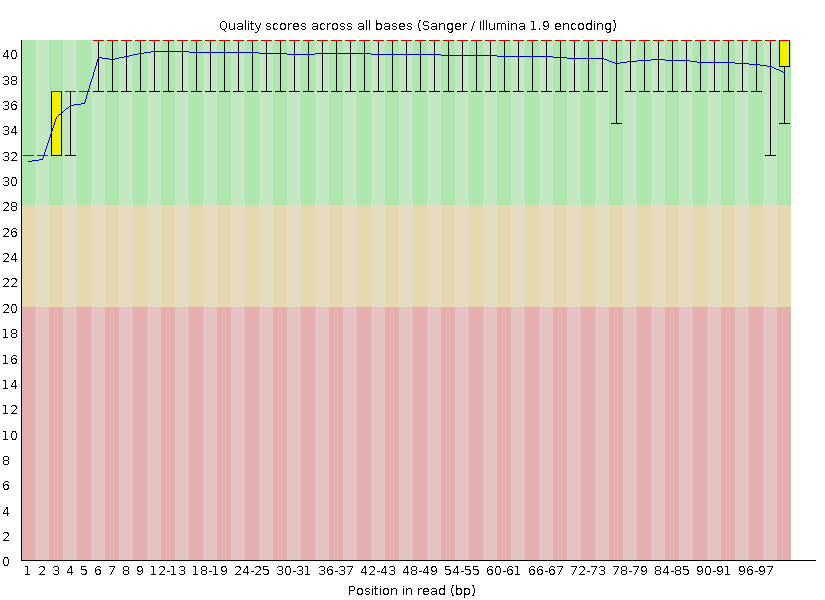
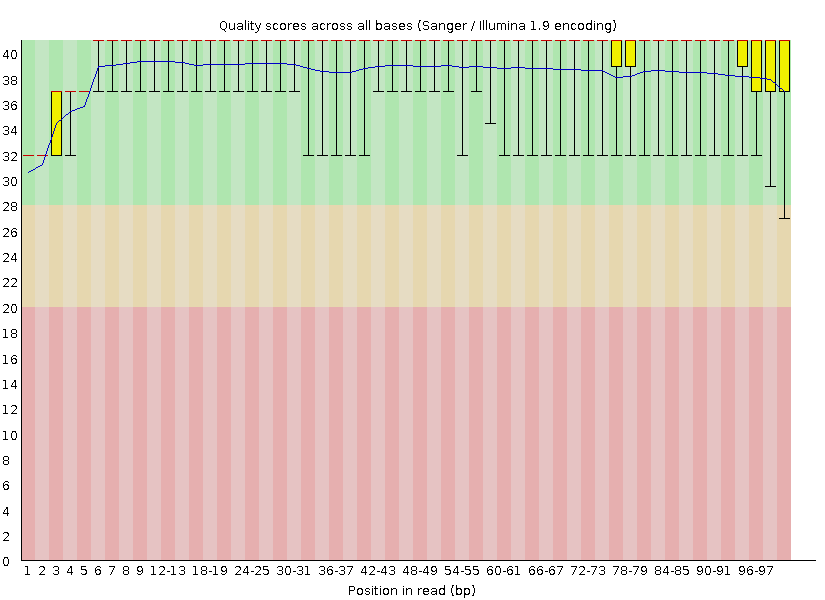
```

```{r, out.width="250px", fig.cap="These plots depict the percentage of n content per total reads in each base of the sequence; Left (11-2H-Both-S9-L008 Read 1) Right (11-2H-Both-S9-L008 Read 2)", fig.show="hold", fig.pos="H", echo= FALSE}

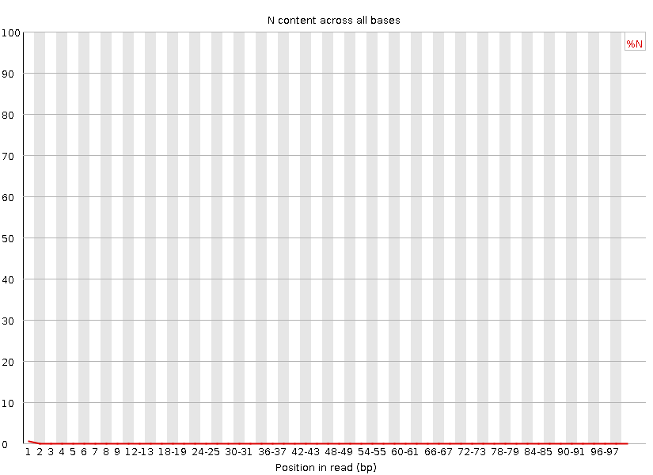
include_graphics("11_2H_both_S9_L008_R2/11_2H_both_S9_L008_R2_001_fastqc/Images/per_base_n_content.png")
```

```{r, out.width="250px", fig.cap="These plots indicate the percentage of adapter content in each base of the sequences; Left (11-2H-Both-S9-L008 Read 1) Right (11-2H-Both-S9-L008 Read 2)", fig.show="hold", fig.pos="H", echo= FALSE}


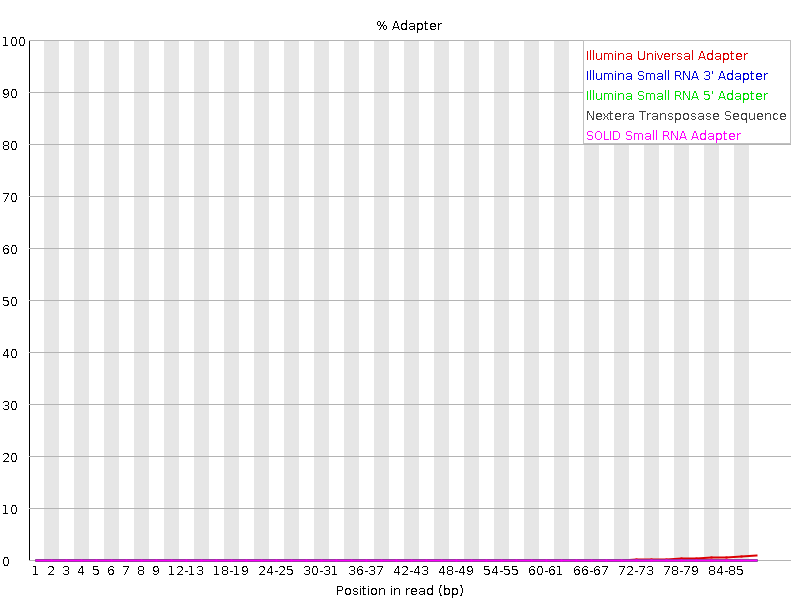
```

We can see in Fig. 2, none of these graphs indicate the presence of any N bases, which is further confirmed by Fig. 1 which shows that all bases in the reads have high enough quality scores to be able to make a good quality, confident base call. This can be seen for read pair 29_4E_fox_S21_L008 as well if you look at Fig. 4 and 5.

### For Demultiplexed file pair 29_4E_fox_S21_L008

```{r, out.width="250px", fig.cap="These plots show the mean quality of each base in the sequence; Left (29-4E-fox-S21-L008 Read 1) Right (29-4E-fox-S21-L008 Read 2)", fig.show="hold", fig.pos="H", echo= FALSE}

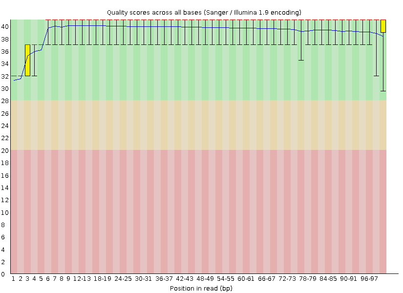
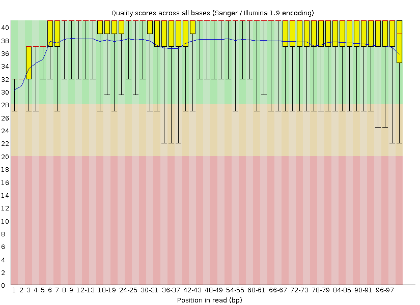
```

```{r, out.width="250px", fig.cap="These plots depict the percentage of n content per total reads in each base of the sequence; Left (29-4E-fox-S21-L008 Read 1) Right 29-4E-fox-S21-L008 Read 2)", fig.show="hold", fig.pos="H", echo= FALSE}

include_graphics("29_4E_fox_S21_L008_R1/29_4E_fox_S21_L008_R1_001_fastqc/Images/per_base_n_content.png")
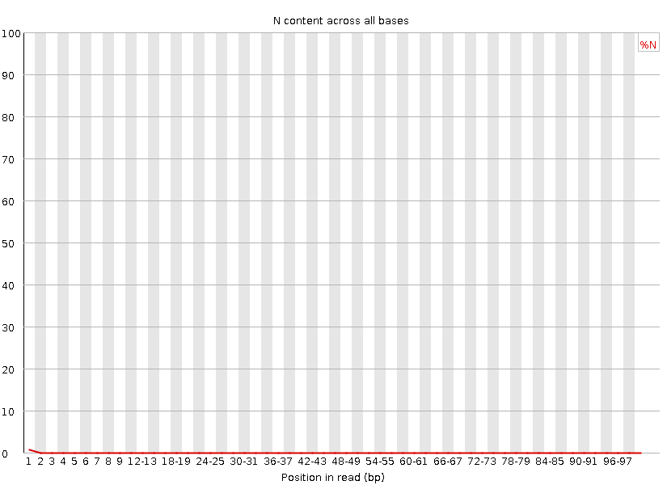
```

```{r, out.width="250px", fig.cap="These plots indicate the percentage of adapter content in each base of the sequences; Left (29-4E-fox-S21-L008 Read 1) Right (29-4E-fox-S21-L008 Read 2)", fig.show="hold", fig.pos="H", echo= FALSE}

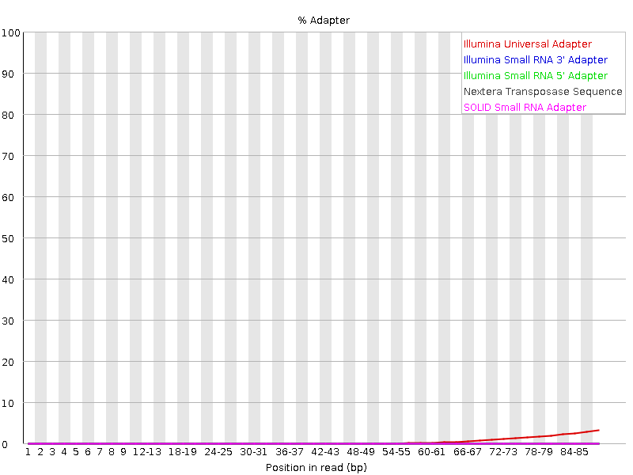
include_graphics("29_4E_fox_S21_L008_R2/29_4E_fox_S21_L008_R2_001_fastqc/Images/adapter_content.png")
```

## Compare my Script to Fastqc

In order to compare the script we created for Demultiplexing, Assignment the First which creates a distribution of the mean quality scores for each base in the sequence of a read, I ran my script on the same file pairs and compared the output graphs as well as their operational output:

You can see from the line of the means on Fig. 1 and 4, that the means distributions follow almost exactly the same distribution from what my eyes can discern in Fig. 7 and 8. The biggest difference is that the fastqc delivers a plot with more information including boxplots on top of the histogram.

### For read pair 11_2H_both_S9_L008

```{r, out.width="250px", fig.cap="These two plot demonstrate the distribution of mean quality score for each base in the sequence of the read; Left (11-2H-Both-S9-L008 Read 1) Right (11-2H-Both-S9-L008 Read 2)", fig.show="hold", fig.pos="H", echo= FALSE}

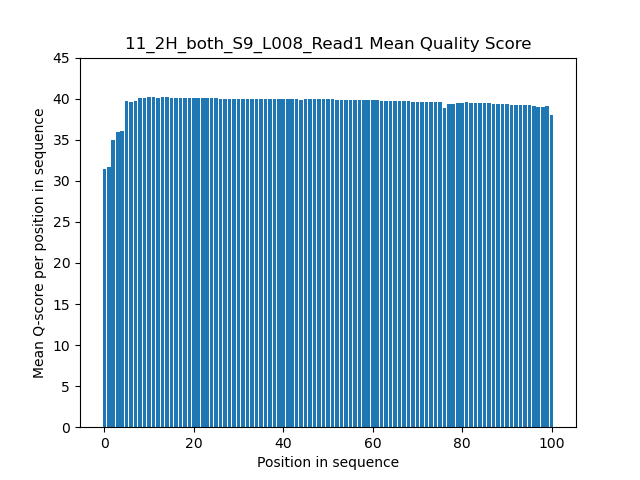
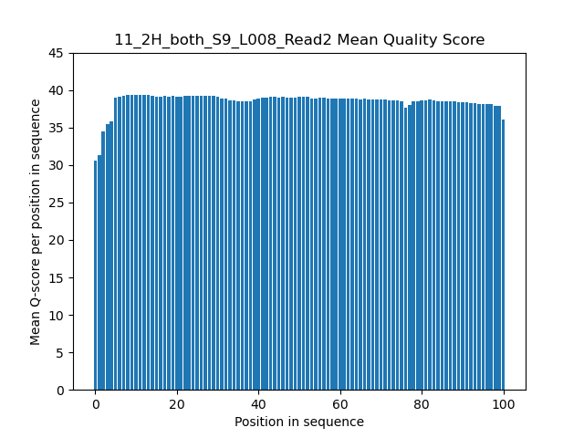
```

### For read pair 29_4E_fox_S21_L008

```{r, out.width="250px", fig.cap="These two plot demonstrate the distribution of mean quality score for each base in the sequence of the read; Left (29-4E-fox-S21-L008 Read 1) Right (29-4E-fox-S21-L008 Read 2)", fig.show="hold", fig.pos="H", echo= FALSE}

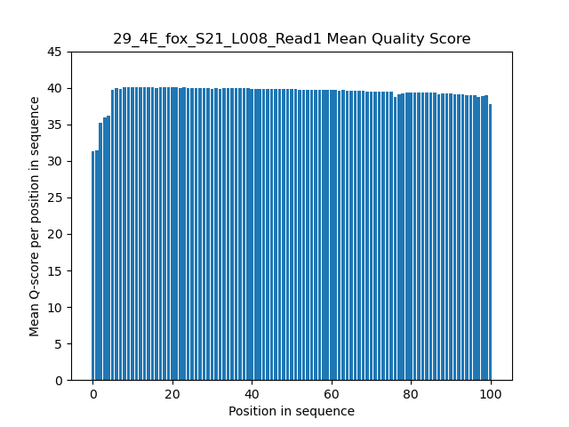
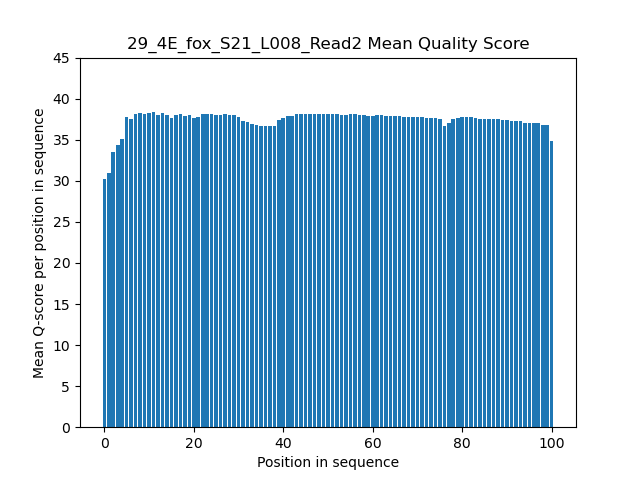
```

Below are the commands used to generate the fastqc data and the plots from my scripty. Output compared for 11_2H_both_S9_L008_R1 is also listed. For the runtime, the fastqc module is about 3 times as fast as my python script. I imagine this could be due to my coding being less elegant and possibly not using the best data structures.
Fastqc seems to be more informative and efficient due to its programming, which I am unable to look into, but I wonder if the fact that is a module helps it to be more powerful as well.

Fastqc:

Results of timing for 11_2H_both_S9_L008_R1:

```
        User time (seconds): 92.12
        System time (seconds): 3.44
        Percent of CPU this job got: 98%
        Elapsed (wall clock) time (h:mm:ss or m:ss): 1:36.91
        Exit status: 0
```

My script:

From script job err output for timing of 11_2H_both_S9_L008_R1:

```
        User time (seconds): 294.88
      	System time (seconds): 0.89
      	Percent of CPU this job got: 99%
      	Elapsed (wall clock) time (h:mm:ss or m:ss): 4:56.03
      	Exit status: 0
```

#### Basic Stats for Fastqc Data

For 11_2H_both_S9_L008:
```{r, out.width="250px", fig.cap="Charts populated from fastqc with basic statistics of the reads and output ; Left (11-2H-both-S9-L008 Read 1) Right (11-2H-both-S9-L008 Read 2)", fig.show="hold", fig.pos="H", echo= FALSE}
include_graphics("Screenshot 2023-09-14 153245.png")
include_graphics("Screenshot 2023-09-14 153307.png")
```

```{r, out.width="250px", fig.cap="Charts populated from fastqc with basic statistics of the reads and output ; Left (29-4E-fox-S21-L008 Read 1) Right (29-4E-fox-S21-L008 Read 2)", fig.show="hold", fig.pos="H", echo= FALSE}
include_graphics("Screenshot 2023-09-14 153324.png")
include_graphics("Screenshot 2023-09-14 153339.png")
```

We see that for the 11_2H_both_S9_L008 reads, the Fig. 1 shows data that is on average for most of the data of a quality score above 32. For 29_4E_fox_S21_L008 reads, Fig. 4 shows an average of at least 32 and most of the data above 36 without too much variation.
Also if we look at Fig. 3 and 6, there is no adapter contamination and where you do see an increase it is minimal. Fig. 2 and 5 show n content is relatively absent. Fig. 9 and 10 show the data is all of an expected size of 101 bp, with reasonably normal GC contents.
So for these two read pairs I would recommend that this is high-quality data that can be further used.
The quality is most likely affected by processing time and degeneration. 
Overall, I would say this data is within acceptable, high-quality range for us to be able to take it further for processing.


# Part 2:  Cutadapt and Trimmomatic 

### Proportion of reads which were trimmed

```{r, echo=FALSE}
samples=c("11_2H_both_S9_L008","29_4E_fox_S21_L008")
R1=c("4.9%","7.5%")
R2=c("5.7%","8.3%")
df=data.frame(samples,R1,R2)
kable(df, caption = "Proportion of Trimmed reads")
```

From the output of cutadapt on my file pairs, I was able to see the percentage of reads which had been trimmed which are shown in Table 1. In both cases, read 1 was trimmed less heavily which might be due to the differences in quality of the reads. I then used the following commands to evaluate whether the adapters had been left in any of the sequences after running cutadapt (these were also run on the 29_4E_fox_S21_L008 read pairs). In all cases, the returned value was 0. This indicates that any entire fragment of adapter were properly trimmed. Although I did try on partial sequences of the adapter which did return a small number of reads, which indicates that there are some reads which were shorter that included portions of the adapters. This is okay at this stage, and further trimming with Trimmomatic then alignment with star will still give valuable information. For future projects I might want to be more stringent with my cutting options and specify slightly more nucleotides of the beginning of the adapter sequence to make sure less of those are included. For our purposes of alignment, not de novo assembly, we will be okay to continue. Similar commands were used on the original fastq data prior to trimming and cutting to show that Reads 1 were contained adapter "AGATCGGAAGAGCACACGTCTGAACTCCAGTCA", whereas Reads 2 were run with adapter "AGATCGGAAGAGCGTCGTGTAGGGAAAGAGTGT". Both adapters only showed per corresponding read and came up with 0 hits before this stage. These commands further show that cutting and trimming was successful. 

```
grep -c "AGATCGGAAGAGCACACGTCTGAACTCCAGTCA" 11_2H_both_S9_L008_cut_R1.fastq 
grep -c "AGATCGGAAGAGCACACGTCTGAACTCCAGTCA" 11_2H_both_S9_L008_cut_R2.fastq 
grep -c "AGATCGGAAGAGCGTCGTGTAGGGAAAGAGTGT" 11_2H_both_S9_L008_cut_R2.fastq 
grep -c "AGATCGGAAGAGCGTCGTGTAGGGAAAGAGTGT" 11_2H_both_S9_L008_cut_R1.fastq 
```

```{r, out.width="250px", fig.cap="These plots show the distribution of lengths of the reads for each read in the read pair for both file pairs; Left (11-2H-Both-S9-L008) Right (29-4E-fox-S21-L008)", fig.show="hold", fig.pos="H", echo= FALSE}

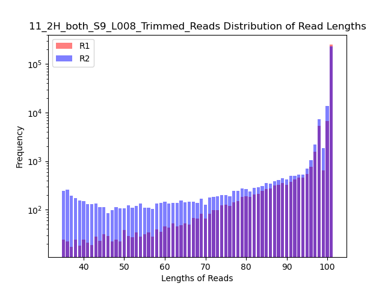
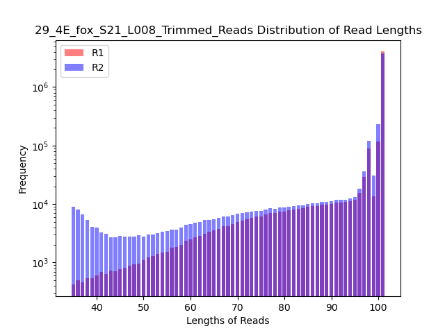
```


If you look at Fig. 11, you can see that in both cases most of the read lengths are about 101 bp which we confirmed with the fastqc plots, although there are many which range between 35 and 100 bp. Also, in both read pairs, Read 2 has more reads that were kept after trimming and cutting out adapters. This could be due to the difference in quality scores of each base in each read, where read two for each file pair were lower on average. This could lead to the observed difference between the number of reads for Read 2 over read 1 in the distribution of lengths, as more calls of lower quality would muddle the sequence reads to not be properly read as adapaters and thereby not cut out properly leading to a greater amount of reads at shorter lengths. In addition, with stringent processing, more unknown reads would lead to more unmatched read pairs and to a difference in the number of reads kept per file as `Trimmomatic` would send more to the unpaired file.  

# Part 3:  Alignment and strand-specificity

In order to investigate the count of reads that map to features after using `star` to create sam files that from our trimmed read files, I used the following commands with my script from PS8:

### Star

For 11_2H_both_S9_L008:
```
./parseSAM.py -f /projects/bgmp/dovee/bioinfo/Bi623/QAA/part_3/11/alignedAligned.out.sam
```

Then I ran it on 29_4E_fox_S21_L008:
```
./parseSAM.py -f /projects/bgmp/dovee/bioinfo/Bi623/QAA/part_3/29/alignedAligned.out.sam
```

The following Table 2 shows the yields from these scripts and their percentages:

```{r, echo=FALSE}
Sample=c("11_2H_both_S9_L008","29_4E_fox_S21_L008")
Mapped=c(523249, 8883008)
Unmapped=c(20029, 260800)
pair_11=(Mapped[1]/(Mapped[1]+Unmapped[1]))*100
pair_29=(Mapped[2]/(Mapped[2]+Unmapped[2]))*100
Percent_Mapped=c(pair_11,pair_29)
df=data.frame(Sample, Mapped,Unmapped, Percent_Mapped)
kable(df, caption = "Proportion of mapped reads from star sam files")
```

### Htseq

After running star, I used the output sam file for each file pair and ran them with `htseq-count` twice, once with the "yes" option for stranded and once with the "reverse" option for stranded. After running them as stated, I then ran the following commands to evaluate the strandedness of the reads using the proportions of those reads which mapped according to each option. 

Sum only reads which mapped to a specific gene:
```
awk '$1~"ENSMUS" {sum+=$2} END {print sum}' 11.tsv      
awk '$1~"ENSMUS" {sum+=$2} END {print sum}' 11_rev.tsv  
awk '$1~"ENSMUS" {sum+=$2} END {print sum}' 29.tsv      
awk '$1~"ENSMUS" {sum+=$2} END {print sum}' 29_rev.tsv   
```
For total number of reads:
```
awk '{sum+=$2} END {print sum}' 11.tsv    
awk '{sum+=$2} END {print sum}' 11_rev.tsv  
awk '{sum+=$2} END {print sum}' 29.tsv      
awk '{sum+=$2} END {print sum}' 29_rev.tsv  
```

```{r, echo=FALSE}
Read_Pair=c("11_2H_both_S9_L008","11_2H_both_S9_L008 Rev","29_4E_fox_S21_L008","29_4E_fox_S21_L008 Rev")
Mapped_to_Feature=c(9174, 215315, 185940, 3859931)
Total_Reads=c(271639, 271639, 4571904, 4571904)
pair_11=(Mapped_to_Feature[1]/Total_Reads[1])*100
pair_11_rev=(Mapped_to_Feature[2]/Total_Reads[2])*100
pair_29=(Mapped_to_Feature[3]/Total_Reads[3])*100
pair_29_rev=(Mapped_to_Feature[4]/Total_Reads[4])*100
Percent_of_Mapped=c(pair_11, pair_11_rev, pair_29, pair_29_rev)
df=data.frame(Read_Pair, Mapped_to_Feature,Total_Reads, Percent_of_Mapped)
kable(df, caption = "Proportion of mapped reads from htseq-count output")
```

From Table 3 you can see that in both cases the reverse option for `htseq-count` yielding much higher percentages of mapped reads, where the percentages of 3.38 and 4.07 are abysmal for what we would want or expect from a well conducted alignment. From this we can conclude that these libraries were prepared in a stranded specific manner with R2 being the equivalent of the antisense strand. 
